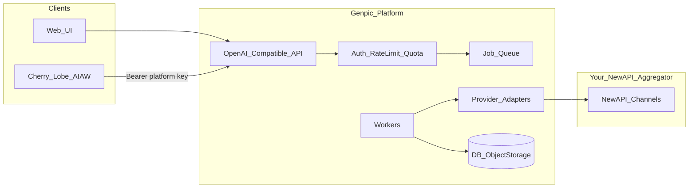

# 视觉工厂类生图平台 — 开发设计文档（修订版）

## 1. 背景与目标

- **产品形态**：参考 [视觉工厂 GPT 图片页](https://d.aijuh.com/#/product/gpt-image) 的三栏布局（功能菜单 / 生成表单+作品区 / 历史），按「厂商 × 系列」拆分子路由，每类模型独立表单与参数校验。
- **首期模型**：
  - **OpenAI**：`gpt-image-2`（走 OpenAI Images API 形态：`/v1/images/generations` 等；具体字段以你方 NewAPI 渠道映射为准）。
  - **Google Gemini「Banana」系列**（Nano Banana）：如 `gemini-2.5-flash-image`、`gemini-3.1-flash-image-preview`、`gemini-3-pro-image-preview`（以你方聚合站实际上架名为准）。
  - **阿里云通义万相**：`wan2.7-image` / `wan2.7-image-pro`（DashScope `multimodal-generation/generation`）。
- **生态要求**：便于接入 NewAPI 的「聊天应用集成」模板（`{key}`、`{address}`），官方说明见 [New API 系统设置 — 聊天集成变量 / 聊天应用集成](https://www.newapi.ai/zh/docs/guide/feature-guide/admin/system-setting-advanced)。

## 2. 关键决策（已确认）

### 2.0 本轮产品确认（2026-05-08）

- **认证与上游**：选定 **模式 A** — 仅服务端持有调用 NewAPI 聚合站的密钥；终端只使用**平台发放的 API Key**。
- **入口约束**：生态侧（聊天应用集成、第三方 OpenAI 兼容客户端）**只允许**配置指向**你们平台对外官方 baseUrl**（`{address}/v1`）；不向终端暴露可用于直连聚合站或其他镜像的上游地址与密钥。

### 2.1 认证与上游：**模式 A — 服务端统一持钥**（与 2.0 一致）

| 角色 | 密钥与地址 | 说明 |
|------|------------|------|
| **终端用户 / 第三方客户端** | 仅使用**你们平台**发放的 API Key；`baseURL = {address}/v1`，其中 `{address}` 为**你们对外域名**（无尾斜杠、不含 `/v1`） | 符合 NewAPI 文档对 `{address}` 的约定；Cherry Studio / AI as Workspace 等按示例拼接即可。 |
| **你们后端 → NewAPI 聚合站** | 使用**服务端配置**的渠道 Key / Base URL（环境变量或密钥管理服务） | 用户**不能**把请求直接导向聚合站再绕过你们；计费、风控、模型白名单均在你们侧完成。 |

**「限制只能从我们平台的 baseUrl」— 产品与技术边界**：

- **产品/运营**：对外文档、控制台「一键集成」、客服话术仅提供**你们自有域名**的 `{address}`；不向终端用户发放可用于直连聚合站的上游 Key 或上游 Base URL。
- **服务端**：调用 NewAPI/各厂商的 **Base URL 与渠道密钥仅来自服务端配置**，禁止从客户端请求体/Header 中读取「任意上游地址」以免被用作开放代理或计费绕过（与 SSRF 风险一并治理）。
- **API Key 语义**：平台发放的 Key 仅在你们 API 网关鉴权；**不**承担「用户拿去填到 NewAPI 控制台当地址」的职责（与模式 A 一致）。
- **Web 控制台**：配置合理 CORS；可选对浏览器请求校验 `Origin`/`Referer`（**增强项**，不能替代鉴权与上游配置约束）。

**推论（需在实现中落实）**：

- 对外 **只信任** `Authorization: Bearer <platform_api_key>`；可选补充：IP 允许列表、按 Key 的模型权限、RPM 限流。
- **禁止**在公开接口中接受「用户自带上游 NewAPI 用户密钥」作为默认路径（若未来要 B/C 模式，另开管理端能力，不纳入首期）。
- 多域名/CDN 场景：若存在多个对外 Host，在配置中维护**允许的 Host 列表**（便于日志与风控对齐「官方入口」）；**控制台「一键集成」与文档中的 `{address}` 仅允许从该列表选取或自动生成**，避免用户复制到非官方镜像域名。
- **验收口径（baseUrl 限制）**：任何成功鉴权的 API 调用，其请求 Host 必须落在「官方对外域名」配置内；响应体与错误信息中**不得**回显可拼接为直连上游的完整 Base URL 或渠道密钥（防「借用你们 Key 打别家 Host」的误配与信息泄露）。

### 2.2 双轨版本策略：MVP Lite 优先，完整系统并存

为降低首期复杂度，产品与技术采用**双轨版本**：

| 版本 | 目标 | 范围 | 代码策略 |
|------|------|------|----------|
| **MVP Lite（优先开发）** | 最快验证“用户填 base + apiKey + model-id + prompt 即可生图” | 原生 HTML/JS 页面 + Go API；单模型/多模型透传、生图调用、返回图片 URL 或 base64、基础错误提示 | **单 Go 服务 + 静态 HTML/JS/CSS，最少依赖、最少文件、最少语言种类** |
| **Full Platform（完整系统）** | 演进到作品库、社区、付费、计费、权限、审核、多 provider 能力 | 本文 §4–§16 的完整平台能力 | 按模块化、公共封装、队列、对象存储、账本等逐步扩展 |

**融合原则**：

- MVP Lite **不是废弃原型**，而是完整系统的第一阶段：保留与完整系统一致的核心概念（`base_url`、`api_key`、`model_id`、`prompt`、统一响应结构、错误码）。
- MVP Lite 的实现可以先**不引入**用户系统、数据库、队列、对象存储、社区、付费、OpenAPI 生成链；但接口命名与配置结构要为后续迁移留口。
- 完整系统上线后，MVP Lite 可继续作为“极简 API 模式 / 调试模式 / 私有部署轻量版”存在，不与完整系统互斥。
- 任何在 MVP Lite 中写死的 provider 特性，必须集中在一个适配函数/文件中，避免后续扩展时散落重构。

**MVP Lite 前端策略**：

- 前端可以只用 **HTML + 原生 JavaScript + 少量 CSS**，不引入 Vue/React、Node.js、npm、打包器或组件库。
- 推荐由 Go 服务直接提供静态页面：`GET /` 返回 `index.html`，`POST /api/generate` 负责转发生成请求；部署时仍是**一个 Go 二进制 + 少量静态文件**。
- 若希望文件更少，可用 Go `embed` 将 `index.html` 内嵌进二进制；若希望调试方便，则保留 `web/index.html`、`web/app.js`、`web/style.css` 三个静态文件。
- `api_key` 首期可在浏览器表单填写并提交给后端；页面不做长期保存。若后续要记住配置，只允许保存在浏览器 `localStorage`，并明确提示“本机保存，勿在公共电脑使用”。

**MVP Lite 最小用户路径**：

1. 用户在页面或配置文件中填写：`base_url`、`api_key`、`model_id`。
2. 用户输入 `prompt`，点击生成。
3. 后端按 OpenAI 兼容 `POST {base_url}/v1/images/generations` 或配置的等价路径转发。
4. 后端返回图片 URL/base64；前端直接展示。

**MVP Lite 暂不做**：注册登录、余额、支付、社区、作品长期保管、复杂队列、后台管理、NSFW 完整审核、跨 provider 能力矩阵。上述能力进入 Full Platform。

## 3. 技术栈选型：后端以 Golang 为主（已倾向）

| 维度 | Hyperf (PHP) | Go（推荐本期后端） |
|------|----------------|-----|
| 团队契合 | 高 | 中（可通过规范与模板拉齐） |
| 源码保密 | 弱（明文部署易暴露业务逻辑） | **强（编译产物）** |
| 并发与长连接 | Swoole 成熟 | 原生优势 |
| NewAPI 生态 | HTTP 客户端 + OpenAPI 无压力 | 同左 |

**本期结论**：**后端以 Go 实现为主**（API 网关、任务队列消费者、适配器、计费与社区权限），满足「服务器上不便暴露 PHP 源码」的约束。PHP/Hyperf 不作为主路径；若个别脚本或遗留工具需 PHP，与主服务通过 HTTP/消息队列边界隔离即可。

**文档层面**：以下架构以 Go 为第一读者；OpenAPI 仍可作为契约中枢（见 5.3、14.3）。

### 3.1 给 PHP 背景工程师的 Go 上手建议（概要）

- **心智模型**：用「显式 `error` 返回 + 早返回」替代大量 try/catch；用「小接口 + 组合」替代深继承；并发用 `context.Context` 贯穿超时/取消。
- **项目骨架**：单仓内分 `cmd/`（入口）、`internal/`（业务不可被外部 import）、`pkg/`（可复用库）；HTTP 用 `chi` 或 `echo`/`fiber` 之一即可，避免过早微服务。
- **学习顺序**：官方 [A Tour of Go](https://go.dev/tour/) → [Effective Go](https://go.dev/doc/effective_go) → 在仓库内先写通 **鉴权 + `GET /v1/models` + 健康检查** 再扩队列与适配器；用 `go test` 表驱动测试覆盖计费与权限边界。
- **依赖管理**：`go mod`；数据库 `sqlc` 或 GORM（二选一，团队定）；配置 `viper`/`env`；日志 `slog` 或 zap。
- **与 PHP 对比的坑**：注意 JSON `omitempty` 与零值；`nil` slice/map 行为；部署用静态链接二进制 + systemd/k8s，无需在服务器保留源码。

## 4. 总体架构

- **同步路径**：仅适合极快返回的上游（慎用）；默认 **异步任务**（queued job + 轮询/Webhook/SSE）。
- **对象存储**：生成图落 OSS/S3/MinIO；DB 存元数据与任务状态。

## 5. NewAPI「聊天应用集成」对齐设计

### 5.1 变量语义（与官方一致）

- `{key}` → 平台为用户/应用发放的 **API Key**。
- `{address}` → **你们对外的 origin**（示例：`https://imgapi.example.com`，**无**末尾 `/`，**不含** `/v1`）。

### 5.2 对外兼容面（首期最小集）

为最大化兼容 OpenAI 系客户端，建议实现：

| 路由 | 用途 |
|------|------|
| `GET /v1/models` | 列出可用图像模型（可映射内部 `provider/model`）。 |
| `POST /v1/images/generations` | **gpt-image-2** 主入口；请求体尽量贴近 OpenAI（`model`, `prompt`, `n`, `size`, `quality`, `response_format` 等）。 |
| `POST /v1/chat/completions`（可选但推荐） | 部分客户端只认聊天接口：对 **Gemini Banana** 可用「单轮 user 消息 + 指示生成图」的约定 schema，或返回 `choices[0].message` 中带图片 URL/base64 的扩展字段（需在 OpenAPI 中**明确非标准字段**并做客户端说明）。 |

**注意**：Wan2.7 的 JSON 与 OpenAI 差异大，有两种策略：

1. **仅 Web 子页 + 内部 REST** 调用 `POST /internal/v1/wan/...`；对外 OpenAI 兼容层不强行伪装 Wan（诚实文档）。
2. 或提供 **窄适配**：在 `images/generations` 中当 `model` 前缀为 `wan2.7-*` 时，服务端翻译成 DashScope 请求（维护成本高，易与 OpenAI 语义冲突）。

**首期推荐**：OpenAI 兼容层专注 **GPT Image**（及可选 Chat 通道给 Gemini）；**Wan2.7 以平台原生 REST + Web 表单为主**，避免伪兼容误导生态客户端。

### 5.3 接口文档（关于「Apidoc」的澄清）

需求中的 **Apidoc** 指 Gitee 项目 [apidoc-php](https://gitee.com/hg-code/apidoc-php)（基于 PHP 注解/注释生成文档），**仅适用于 PHP 技术栈**。

**本期后端已倾向 Go**，故 **不将 apidoc-php 纳入主方案**；接口文档以 **OpenAPI 3.x**（`openapi.yaml` / `openapi.json`）为单一契约，配合 `swaggo/swag` 或 `oapi-codegen` + Scalar/Redoc 等静态 UI 即可，细节从简、实现阶段再定。

## 6. 领域模型与数据表（建议）

- `users`：登录主体（若首期只做 API Key 也可弱化）。
- `api_keys`：`key_hash`、`name`、`scopes`（允许的 `model` 列表）、`rpm_limit`、`expires_at`、`disabled_at`。
- `credit_ledger`：预扣/实扣/冲正（与「算力」一致）；记录关联 `job_id`。
- `generation_jobs`：`id`, `user_id`, `api_key_id`, `provider`(`openai`|`gemini`|`wan`), `model`, `normalized_request`（JSON）, `status`, `error_code`, `upstream_request_id`, `created_at`, `finished_at`。
- `assets`：`job_id`, `storage_url`, `mime`, `width`, `height`, `sha256`。
- **`works`（或 `generation_jobs` 扩展字段）**：与对外展示强相关——`visibility`（见第 13 节）、`title`/`prompt_summary`（可截断）、`community_listed_at`、`nsfw_flag`、`like_count`（若做社区）；**全文 `prompt` 可加密或分表**，列表接口默认不返回完整提示词。
- **`entitlements` / `subscriptions`（可选表或 JSON）**：用户是否开通「社区浏览」「高清原图下载」「隐藏作品不被收录社区」等 SKU，供鉴权中间件读取。

**任务状态机**：`queued` → `running` → `succeeded` | `failed`；失败需可重试策略与上游超时配置。

## 7. 三模型能力与表单设计（按子页拆分）

### 7.1 GPT Image（`gpt-image-2`）

- **能力**：文生图；图生图/编辑若上游支持则单独区块（multipart `image` + `mask` 或官方推荐的 edits 流）。
- **表单字段（示例）**：`prompt`、`n`、`size`（含 auto）、`quality`、`output_format`、`background`、`moderation`、参考图数量上限（与 OpenAI 限制对齐）。
- **适配器**：请求 → NewAPI 的 OpenAI 兼容通道；响应 b64/url → 落存储 + 返回统一 `job`/`asset` 结构。

### 7.2 Gemini Banana 系列

- **上游形态**：`generateContent`，多模态 parts（文本 + 可选参考图），响应中含 `inlineData` 图片（见 [Gemini image generation 文档](https://ai.google.dev/gemini-api/docs/image-generation)）。
- **子页策略**：按模型分 Tab 或子路由：`2.5-flash-image` / `3.1-flash-image-preview` / `3-pro-image-preview`。
- **表单差异**：
  - 是否开启 **Thinking**（若上游暴露）。
  - **纵横比 / 分辨率档位**（Banana 2/Pro 文档中的多档分辨率与比例，与 OpenAI 的 `size` 字符串不同，需单独枚举）。
  - **Grounding / 联网搜索**（若聚合渠道支持且你们愿意承担成本与延迟）。
  - **SynthID**：对用户说明不可关闭（合规展示即可）。
- **适配器**：将表单映射为聚合站要求的 `model` + `generationConfig`（字段名以你方 NewAPI 映射为准，设计里预留 `ProviderCapabilities` 配置表或 YAML）。

### 7.3 Wan2.7-image / wan2.7-image-pro

- **上游形态**：`POST .../multimodal-generation/generation`，`input.messages[0].content` 为 `text` / `image` 数组；`parameters` 含 `size`（如 `1K`/`2K`/文生图 4K 限制）、`n`、`watermark`、`thinking_mode`、`enable_sequential`、`bbox_list` 等（见阿里云 [万相 2.7 API 参考](https://help.aliyun.com/zh/model-studio/wan-image-generation-and-editing-api-reference)）。
- **子页模式**：文生图 / 图像编辑 / 交互式编辑 / 组图 —— **首期可只做文生图 + 简单多图编辑**，其余标为「后续迭代」以免范围爆炸。
- **适配器**：严格构造 DashScope JSON；处理北京/新加坡 **endpoint 与 Key 地域一致**（配置项 `DASHSCOPE_REGION`）。

## 8. 异步、实时与前端

- **队列**：Redis Stream / NATS（与 Go worker 常见组合）；任务状态与队列消息 id 关联便于排障。
- **Web 控制台**：表单提交 → 返回 `job_id` → 轮询 `GET /v1/jobs/{id}` 或 SSE；画廊与右侧历史读同一查询接口。
- **鉴权**：Web 会话（Cookie/JWT）与 API Key 体系可共用 `user_id`，便于算力扣费一致。

## 9. 安全与合规

- **密钥**：平台 Key 只存 hash（bcrypt/argon2）；上游 Key 用 KMS 或 sealed env。
- **内容安全**：提示词与参考图可接入审核（自建或上游）；记录拒绝原因。
- **水印与版权**：Wan 的 `watermark` 参数与 Gemini SynthID 在用户协议与 UI 中说明。

## 10. 可观测性与运维

- **结构化日志**：`job_id`、`api_key_id`（脱敏）、`provider`、`latency`、`upstream_status`。
- **指标**：成功率、队列深度、按模型消费金额/算力。
- **配置**：各模型 `timeout`、`max_reference_images`、价格表（算力换算）。

## 11. 交付里程碑（建议）

0. **MVP Lite**：单 Go 服务 + 原生 HTML/JS 极简页面/API；用户填写 `base_url`、`api_key`、`model_id`、`prompt` 即可生图；不做数据库、队列、支付、社区，不引入前端框架或 Node 构建链。
1. **M0**：在 MVP Lite 验证通过后，整理仓库脚手架 + OpenAPI CI + `GET /v1/models` + Key 鉴权 + 限流。
2. **M1**：`images/generations` → gpt-image-2 全链路（异步 + 存储 + 任务查询）。
3. **M2**：Gemini Banana 子页 + 适配器 +（可选）`chat/completions` 窄约定。
4. **M3**：Wan2.7 子页（文生图 + 基础多图）+ 适配器。
5. **M4**：算力账本、管理后台、集成向导（一键复制 `{address}` 模板）。
6. **M5**：作品保管与列表性能（缩略图、CDN、生命周期）；社区与付费权限（第 12–13 节）。

## 12. Token / 上游成本、生成记录与作品保管

本节「Token」兼指：**上游按量计费**（如部分通道按 token 或等价计量）与 **你们侧存储/带宽成本**；目标是少花钱、少泄露、可追溯。

### 12.1 节省上游与传输成本

- **避免无效调用**：入参校验在网关完成；幂等键（`Idempotency-Key`）防止客户端连点重复排队；对相同 `prompt_hash + model + 关键参数` 可配置**短时去重窗口**（注意版权与用户预期，默认关闭或仅对内测）。
- **响应形态**：对外 API 优先返回 **短期签名的 HTTPS URL**（对象存储预签名），避免在 JSON 里塞 **大体积 base64**（省出口带宽与客户端内存）；OpenAI 兼容字段与内部存储解耦。
- **聊天兼容路径**：若实现 `POST /v1/chat/completions`，**禁止**默认携带长多轮历史做生图；单轮 system 约束 + user 内容即可，减少无谓 token。
- **日志与排障**：结构化日志中 **默认不落全文 prompt**（可存 hash 或前 N 字符）；需要取证时用管理权限查 DB 审计表。
- **重试策略**：仅对幂等安全或上游明确可重试的错误重试；带抖动退避，避免放大账单。

### 12.2 用户生成记录（审计与体验）

- **权威记录**：`generation_jobs` + `assets` + `works` 元数据；失败任务也保留（便于客服与冲正算力）。
- **列表与详情**：列表页返回缩略图 URL、`prompt_summary`、模型、时间、状态；**详情接口**再决定是否返回完整 prompt（受可见性与本人/管理员限制）。
- **合规与删除**：提供用户「删除作品与记录」流程（对象存储对象 + DB 行或软删标记）；保留期在隐私政策中写明。

### 12.3 作品文件保管（对象存储为中心）

- **存储**：原图与衍生图（缩略图、webp 预览）存 **OSS/S3/兼容 MinIO**；DB 仅存 key、版本与元数据。
- **访问控制**：浏览器经 **CDN + 短签名 URL** 拉取；禁止长期公开裸路径；可选 **原图仅付费/本人可拉**。
- **生命周期**：冷数据转低频存储或定期清理「已删除/过期」对象；大图可异步生成多档缩略图减轻列表成本。

## 13. 社区发现、隐私保护与付费机制

### 13.1 作品可见性（建议枚举）

| 值 | 含义 | 社区/发现流 |
|----|------|-------------|
| `private` | 仅本人（及管理员） | 不出现 |
| `unlisted` | 拥有链接者可看（可选） | 不出现 |
| `public` | 全站公开列表可收录 | 可出现（仍受审核与 NSFW 策略约束） |

默认新建作品为 **`private`**，需用户主动切换为 `public`（防误公开）。

### 13.2 「看别人创作」与付费点

- **社区信息流**：仅 `visibility=public` 且审核通过的作品；分页 + 排序（时间/热度）；**缩略图与降采样预览**可对全员开放以降低带宽。
- **付费机制（可组合）**：
  - **会员/订阅**：开通「社区无限浏览」「高清原图」「批量下载」等权益，映射到 `entitlements`。
  - **按次解锁**：单张作品「解锁高清/原图」扣算力或法币（适合高价值图）。
  - **仅 API 用户**：Web 社区与 OpenAI 兼容 API 可拆成不同产品层，避免 Key 泄露导致爬虫拖库（见 API 限流与 scope）。
- **保护自己作品**：除 `private` 外，提供「**禁止出现在社区推荐**」开关（即使 `public` 也可只通过直链分享）；可选 **水印策略**（平台水印 vs 上游水印参数）；支持举报与下架流程（运营后台）。

### 13.3 鉴权与实现要点

- **所有读作品接口**统一走「资源级 ACL」：`owner` / `admin` / `public` / `entitled_viewer`。
- **防爬与盗链**：CDN Referer 规则、速率限制、异常流量告警；公开缩略图与受保护原图分桶或分路径签名策略。
- **OpenAPI 文档**：对「社区列表」「作品详情」单独 tag，与 `/v1/images/generations` 区分，避免第三方客户端误用 Web 专用路由。

## 14. Golang 后端落地补充（与第 3 节呼应）

### 14.1 推荐技术组合（保守可维护）

- **HTTP**：`chi` + `middleware` 标准库风格，或 `echo`（二选一，全团队统一）。
- **DB**：PostgreSQL；迁移用 `goose`/`atlas`。
- **队列**：Redis（Stream）或 NATS；任务状态与队列消息 id 关联便于排障。
- **对象存储**：S3 SDK（兼容各家 OSS）。

### 14.2 模块边界（单仓可演进）

- `internal/api`：HTTP 路由与 DTO
- `internal/auth`、`internal/billing`、`internal/community`
- `internal/provider`：OpenAI/Gemini/Wan 适配器 + 超时与重试
- `internal/storage`：上传、签名 URL、生命周期任务

### 14.3 不熟 Go 时的工程化拐杖

- **先写 OpenAPI**：用 `oapi-codegen` 生成 `ServerInterface` 与类型，路由里只做薄适配，减少手写 JSON 结构出错。
- **静态检查**：`golangci-lint` CI 必过；`go vet`。
- **可观测性**：`slog` + OpenTelemetry traceId 贯穿网关→worker→上游 HTTP。

## 15. 工程规范：高内聚 / 低耦合 / 可复用 / 可维护

> 本节为**强约束**，覆盖 Go 后端、Web 前端及任何附属服务。所有 PR 评审与 CI 都按此校准。

### 15.1 模块化与边界

- **高内聚**：每个模块只解决一类问题；`auth` 不混 `billing`，`provider` 不混 `community`（与 §14.2 模块边界一致）。
- **低耦合**：跨模块**只依赖接口**，不暴露内部 struct；新增上游 provider 不应触发 `billing`/`auth` 修改。
- **依赖方向**：`api → application → domain → infrastructure`，单向；HTTP DTO 与 domain entity **分离**，避免 OpenAPI 字段渗透到核心逻辑。
- **契约面稳定**：对外 API 由 OpenAPI 锁定；内部模块边界由 Go interface 锁定；任何破坏性修改必须发 ADR（见 §15.3）。

### 15.2 公共封装清单（M0 阶段先落骨架，再写业务）

> 凡被 ≥2 处复用、或属于横切关注点的能力，都抽到公共包，**禁止**散落在业务代码里。

| 包 | 职责 | 主要复用方 |
|----|------|------------|
| `pkg/httpclient` | 超时、重试、熔断、上游错误归一化、出入参日志（脱敏） | 三家 provider 适配器、支付/审核外联 |
| `pkg/provider` | `Provider` / `Capability` / `Request` / `Response` 抽象 + Registry | OpenAI / Gemini / Wan 等所有上游 |
| `pkg/objstore` | S3/OSS/MinIO 统一封装：上传、预签名、生命周期、分桶策略 | 作品原图、缩略图、参考图 |
| `pkg/idempotency` | `Idempotency-Key` 解析、KV 落地、并发去重 | 任务创建、支付回调、社区操作 |
| `pkg/ratelimit` | 多维（Key / User / IP / 全局）滑动窗口限流 | 网关中间件、社区接口 |
| `pkg/billing` | 算力换算、预扣/实扣/冲正、事务一致性 | 任务流程、订阅、按次解锁 |
| `pkg/auth` | API Key 校验、scope/Origin/IP 检查、Web Session | 网关中间件、社区 ACL |
| `pkg/errors` | 统一错误码 + OpenAI 兼容错误体（`{error:{type,code,message}}`） | 全栈 |
| `pkg/logger` / `pkg/tracing` | `slog` wrapper + traceId 注入 + 字段脱敏 | 全栈 |

**规则**：业务代码**只调用** `pkg/*` 与 `internal/*`，不直接 import `aws-sdk` / `redis-go` / 大型工具库；如需新增三方依赖，先在公共包内做薄壳封装，便于以后替换。

### 15.3 文档与代码注释规范

**仓库内文档分层**（与代码同仓维护，避免文档漂移）：

- `README.md`：环境准备、跑起来、常用命令
- `docs/architecture.md`：系统蓝图（本设计文档的精简引用版）
- `docs/runbook.md`：生产运维手册（排障、上游故障切换、配额耗尽预案）
- `docs/decisions/`：每次重大技术决策一篇 **ADR**（编号 + 日期 + 上下文 / 选项 / 结论 / 影响）
- `openapi.yaml`：对外契约（CI 验证；`servers` 固定单一官方 origin）
- `CHANGELOG.md`：面向用户/调用方的变更说明

**代码注释**：

- 每个包写 `doc.go`，一句话讲清职责与边界。
- 所有**导出符号**（公共函数 / 接口 / 类型）必须有 godoc：意图、不变量、错误返回的语义。
- **解释“为什么”，不解释“做什么”**：禁止 `// 自增计数器` 这类废话注释。
- 绕坑、上游 quirk、性能权衡处**必须**留注释，并引用上游文档链接或 issue 编号。
- 废弃代码用 `// Deprecated:` 起注释，注明替代方案与计划移除版本。
- 所有 TODO 必须带责任人与 issue：`// TODO(@user, #123): ...`。

### 15.4 PR 与机器约束

- **CI 必过**：`gofmt -s` / `go vet` / `golangci-lint`；OpenAPI lint；单元测试覆盖关键路径；新增 provider 必须配套 fake 实现 + 用例。
- **PR 模板**包含：变更点、影响面、回滚方案、是否需要 ADR、是否更新 OpenAPI/文档。
- **跨模块改动**：触及 `pkg/*` 公共包的 PR 强制第二人评审。
- **新增 Provider 必须**：实现 `provider.Provider` 接口、提供 `provider/<name>/fake` 供本地与 CI、写 godoc 与一篇 ADR。
- **新增配置项**：必须在 `config.example.yaml` 与 `docs/runbook.md` 同步，否则 CI 拒绝合并（用模板检查脚本）。

## 16. 风险与待办（实现前核对）

- **NewAPI 渠道真实路径**：各模型在聚合站上的 **实际 model 名、是否支持流式、是否统一 OpenAI 路径** 需对照你们后台配置做一次「契约表」，适配器以该表为单一配置源。
- **聊天应用集成**：仅保证 **baseUrl + apiKey** 不够时，要在文档中列出已验证客户端清单与已知限制（例如某客户端不支持 `images/generations`）。
- **社区与版权**：公开作品的用户协议、侵权投诉通道、地域合规（尤其带真人肖像内容时）。
- **公共包冻结时间点**：`pkg/*` 的接口形态须在 M0 末冻结一版（可演进，但破坏性修改要发 ADR），避免业务代码在多个 provider 接入后大面积返工。

---

本修订版已将 **认证模式固定为 A（服务端统一持钥 + 仅平台 baseUrl）**；补充 **Token/成本/记录与作品保管**、**社区与付费权限**、**后端以 Go 为主的学习与工程建议**，以及 **工程规范（高内聚/低耦合、公共封装、文档与代码注释要求）**。
